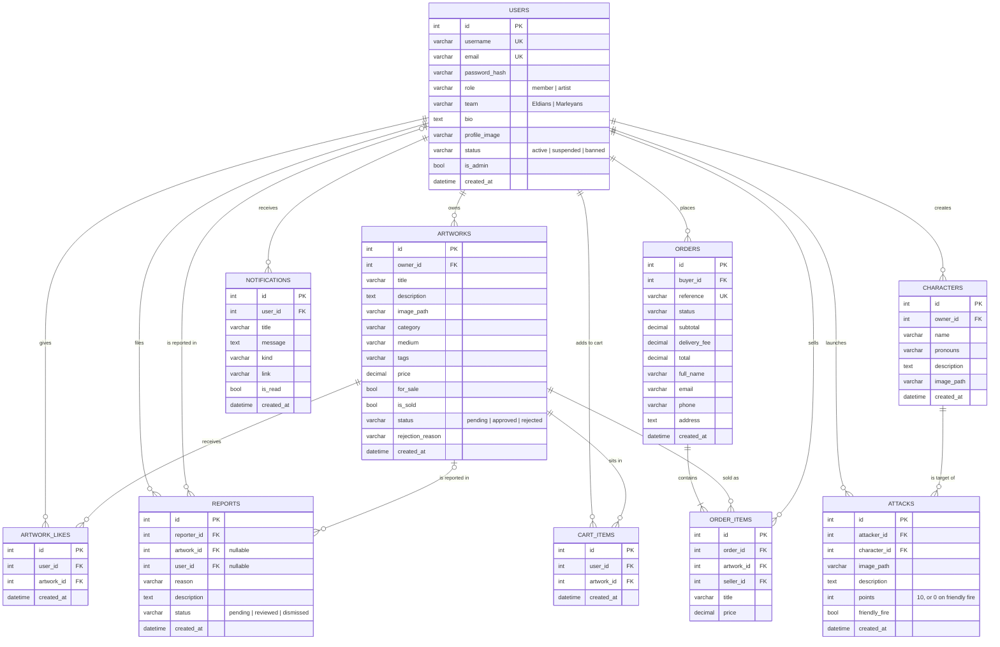

# Database design

Art Attack uses ten tables, all defined as SQLAlchemy models in [`app.py`](../app.py). The same schema runs on MySQL (production) and SQLite (local demo); `flask init-db` creates it with `db.create_all()`.

## ER diagram

## Constraints

### Unique keys

| Table | Columns | Purpose |
|---|---|---|
| `users` | `username` | One account per name |
| `users` | `email` | One account per email |
| `artwork_likes` | `(user_id, artwork_id)` | A user can like an artwork only once |
| `cart_items` | `(user_id, artwork_id)` | No duplicate cart entries |
| `orders` | `reference` | Human-readable order ID, e.g. `AA-260928-3F9A1C` |

### Foreign keys and delete rules

| Foreign key | References | On delete |
|---|---|---|
| `artworks.owner_id` | `users.id` | CASCADE |
| `characters.owner_id` | `users.id` | CASCADE |
| `artwork_likes.user_id` / `artwork_id` | `users.id` / `artworks.id` | CASCADE |
| `attacks.attacker_id` | `users.id` | CASCADE |
| `attacks.character_id` | `characters.id` | CASCADE |
| `reports.reporter_id` / `user_id` | `users.id` | CASCADE |
| `reports.artwork_id` | `artworks.id` | CASCADE |
| `cart_items.user_id` / `artwork_id` | `users.id` / `artworks.id` | CASCADE |
| `notifications.user_id` | `users.id` | CASCADE |
| `orders.buyer_id` | `users.id` | **RESTRICT** |
| `order_items.order_id` | `orders.id` | CASCADE |
| `order_items.artwork_id` | `artworks.id` | **RESTRICT** |
| `order_items.seller_id` | `users.id` | **RESTRICT** |

Sales records use RESTRICT, so a user or artwork that appears in an order can't be deleted and the purchase history stays intact. Everything else cascades with its owner.

`order_items` also copies the artwork's `title` and `price` at checkout, so the receipt still shows what was paid even if the artwork is edited later.

### Indexes

Besides primary keys and unique columns, these columns are indexed: `artworks.owner_id`, `artworks.status`, `artworks.created_at`, `characters.owner_id`, `attacks.attacker_id`, `attacks.character_id`, `reports.status`, `orders.buyer_id` and `notifications.user_id`. They back the most frequent queries: browsing approved artwork newest-first, loading a user's dashboard, and the moderation queues.

## Notable queries

| Feature | Query shape |
|---|---|
| Team scoreboard (home page) | `users` LEFT JOIN `attacks` on the attacker, `SUM(points)` grouped by `team` |
| Sort by popularity (browse) | Subquery counting `artwork_likes` per artwork, LEFT JOINed to `artworks` and ordered by the count |
| Seller revenue (dashboard) | `SUM(order_items.price)` JOIN `orders` where the seller matches and the order isn't cancelled |
| Platform revenue (admin) | `SUM(orders.total)` for non-cancelled orders |
| Attacks received (dashboard) | `attacks` JOIN `characters` where the character's owner is the current user |
